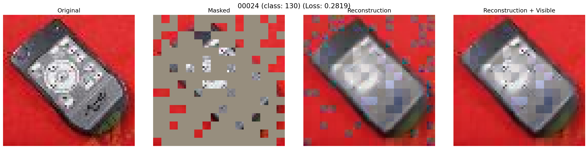
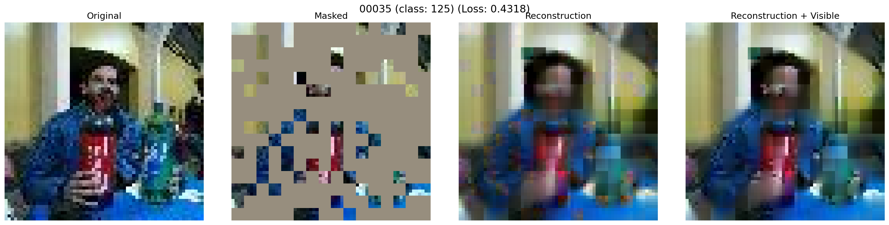

# Tiny ImageNet MAE Training

This repository contains scripts and configurations for training MAE (Masked Autoencoder) on Tiny ImageNet dataset (64x64 images, 200 classes).

## Dataset Structure

The dataset is organized in ImageFolder format:
```
/data/lhs1208/mae_res_64/data/
├── train/          # 90% of original train (90,000 images)
│   ├── 0/          # Class directories (0-199)
│   ├── 1/
│   └── ...
├── val/            # 10% of original train (10,000 images) - for validation during training
│   ├── 0/
│   ├── 1/
│   └── ...
└── test/           # Original valid split (10,000 images) - for final testing
    ├── 0/
    ├── 1/
    └── ...
```

## Setup

1. **Install dependencies**:
```bash
pip install -r requirements.txt
```

2. **Prepare the dataset**:
```bash
cd /data/lhs1208/mae_res_64
python scripts/prepare_tiny_imagenet.py --data_dir /data/lhs1208/mae_res_64/data
```

This will:
- Download tiny-imagenet from Hugging Face
- Organize into ImageFolder structure
- Split train data 90/10 (stratified)
- Save valid split as test

## Model Architecture

- **Pre-training**: `mae_vit_base_patch4` - ViT-Base with patch size 4 (for 64x64 images)
- **Fine-tuning**: `vit_base_patch4` - ViT-Base with patch size 4, 200 classes

Patch size 4 means 64x64 images are divided into 16x16 patches (64/4 = 16).

## Training

### Pre-training

Train MAE from scratch:
```bash
# Use default GPU (device 0)
bash scripts/train_pretrain.sh

# Or specify GPU device ID
bash scripts/train_pretrain.sh 1  # Use GPU 1
```

Or run manually:
```bash
cd /data/lhs1208/mae_res_64/mae
CUDA_VISIBLE_DEVICES=0 python main_pretrain.py \
    --batch_size 256 \
    --epochs 400 \
    --model mae_vit_base_patch4 \
    --input_size 64 \
    --mask_ratio 0.75 \
    --norm_pix_loss \
    --blr 1.5e-4 \
    --weight_decay 0.05 \
    --warmup_epochs 40 \
    --data_path /data/lhs1208/mae_res_64/data \
    --output_dir /data/lhs1208/mae_res_64/output/pretrain \
    --log_dir /data/lhs1208/mae_res_64/logs/pretrain
```

**Pre-training Parameters**:
- Batch size: 256
- Epochs: 400
- Learning rate: 1.5e-4 (base)
- Mask ratio: 0.75
- Warmup epochs: 40

### Fine-tuning

Fine-tune for classification (after pre-training):
```bash
# Use default GPU (device 0)
bash scripts/train_finetune.sh

# Or specify GPU device ID
bash scripts/train_finetune.sh 1  # Use GPU 1
```

**Important**: Update the `PRETRAIN_CHECKPOINT` path in `scripts/train_finetune.sh` before running!

Or run manually:
```bash
cd /data/lhs1208/mae_res_64/mae
CUDA_VISIBLE_DEVICES=0 python main_finetune.py \
    --batch_size 256 \
    --epochs 100 \
    --model vit_base_patch4 \
    --input_size 64 \
    --nb_classes 200 \
    --drop_path 0.1 \
    --blr 1e-3 \
    --layer_decay 0.75 \
    --weight_decay 0.05 \
    --warmup_epochs 5 \
    --finetune /path/to/pretrain/checkpoint.pth \
    --global_pool \
    --data_path /data/lhs1208/mae_res_64/data \
    --output_dir /data/lhs1208/mae_res_64/output/finetune \
    --log_dir /data/lhs1208/mae_res_64/logs/finetune
```

**Fine-tuning Parameters**:
- Batch size: 256
- Epochs: 100
- Learning rate: 1e-3 (base)
- Layer decay: 0.75
- Warmup epochs: 5
- Drop path: 0.1
- Label smoothing: 0.1

**Note**: For 64x64 images, augmentation is simplified (RandomResizedCrop + RandomHorizontalFlip). Advanced augmentation parameters (color_jitter, AutoAugment, RandomErase) are not applied for small images.

### Testing

Evaluate fine-tuned model on test set:
```bash
# Use default GPU and checkpoint
bash scripts/test_finetune.sh

# Specify GPU device ID
bash scripts/test_finetune.sh 1

# Specify custom checkpoint path
bash scripts/test_finetune.sh 0 /path/to/checkpoint.pth
```

Or run manually:
```bash
cd /data/lhs1208/mae_res_64/mae
python main_test.py \
    --resume /path/to/finetune/checkpoint.pth \
    --data_path /data/lhs1208/mae_res_64/data \
    --model vit_base_patch4 \
    --input_size 64 \
    --nb_classes 200 \
    --batch_size 256 \
    --global_pool
```

**Test Results**:
- The script evaluates on the `test/` folder (separate from validation)
- Outputs Accuracy@1, Accuracy@5, and Loss
- Uses evaluation transforms (no augmentation)

## Visualization

Visualize MAE reconstructions on validation images:

```bash
# Basic usage (visualizes 10 random images, uses GPU 0)
python scripts/visualize_valid.py

# Use specific GPU device
python scripts/visualize_valid.py --gpu 1

# Use CPU instead of GPU
python scripts/visualize_valid.py --gpu -1

# With custom options
python scripts/visualize_valid.py \
    --num_images 20 \
    --mask_ratio 0.75 \
    --seed 42 \
    --gpu 0

# Or use explicit device string
python scripts/visualize_valid.py --device cuda:1
```

This script will:
- Automatically find the most recent checkpoint in `/data/lhs1208/mae_res_64/output/pretrain`
- Randomly select images from `/data/lhs1208/mae_res_64/data/val`
- Generate visualizations showing:
  - Original image
  - Masked image
  - Reconstruction
  - Reconstruction + visible patches
- Save results to `/data/lhs1208/mae_res_64/output/pretrain/visualize`

**Options**:
- `--num_images`: Number of random images to visualize (default: 10)
- `--mask_ratio`: Masking ratio (default: 0.75)
- `--seed`: Random seed for reproducibility (default: 42)
- `--gpu`: GPU device ID to use (default: 0). Use `-1` for CPU
- `--device`: Explicit device string (e.g., 'cuda:0', 'cuda:1', 'cpu'). If specified, overrides `--gpu` option

**Note**: Requires `matplotlib` for visualization. Install with `pip install matplotlib` if not already installed.

### Visualization Examples

Here are example visualizations generated by the MAE model on Tiny ImageNet:

**Example 1:**


**Example 2:**


Each visualization shows (from left to right):
1. **Original Image**: The input image from the validation set
2. **Masked Image**: Input with 75% of patches masked (shown in gray)
3. **Reconstruction**: MAE's reconstruction of the masked patches
4. **Reconstruction + Visible**: Combined view showing both visible patches and reconstructions

The visualizations demonstrate how well the MAE model learns to reconstruct masked image patches during pre-training.

## Scripts Overview

### Training Scripts
- `scripts/train_pretrain.sh` - Pre-training script
- `scripts/train_finetune.sh` - Fine-tuning script

### Evaluation Scripts
- `scripts/test_finetune.sh` - Test evaluation script (evaluates on test set)

### Utility Scripts
- `scripts/prepare_tiny_imagenet.py` - Dataset preparation
- `scripts/visualize_valid.py` - Visualization of MAE reconstructions
- `scripts/setup.sh` - Environment setup (if needed)

### Main Python Scripts
- `mae/main_pretrain.py` - Pre-training main script
- `mae/main_finetune.py` - Fine-tuning main script
- `mae/main_test.py` - Test evaluation main script
- `mae/main_linprobe.py` - Linear probing (optional)

## Output Structure

```
/data/lhs1208/mae_res_64/
├── output/
│   ├── pretrain/           # Pre-training checkpoints
│   │   ├── checkpoint-*.pth
│   │   └── visualize/      # Visualization results
│   └── finetune/           # Fine-tuning checkpoints
│       ├── checkpoint-*.pth
│       └── log.txt         # Training logs (JSON format)
└── logs/
    ├── pretrain/           # Pre-training tensorboard logs
    └── finetune/           # Fine-tuning tensorboard logs
```

## Training Logs

Fine-tuning logs are saved in JSON format at `output/finetune/log.txt`. Each line contains:
- `train_lr`: Learning rate
- `train_loss`: Training loss
- `test_loss`: Validation loss (on val set)
- `test_acc1`: Top-1 accuracy (on val set)
- `test_acc5`: Top-5 accuracy (on val set)
- `epoch`: Epoch number
- `n_parameters`: Number of model parameters

**Note**: During training, "test" metrics refer to validation set (`val/` folder). For final evaluation on test set, use `scripts/test_finetune.sh`.

## Dataset Split Details

- **train/**: 90,000 images (90% of original training set) - Used for training
- **val/**: 10,000 images (10% of original training set) - Used for validation during training
- **test/**: 10,000 images (original validation set) - Used for final evaluation only

## Notes

- Pre-training uses only the train split (no labels needed)
- Fine-tuning uses train/val splits for supervised classification
- Test set is kept separate for final evaluation
- All images are 64x64 pixels
- Model uses patch size 4, resulting in 16x16 patches
- For 64x64 images, augmentation is simplified compared to standard ImageNet training

## Troubleshooting

### GPU Memory Issues
If you encounter out-of-memory errors:
- Reduce `BATCH_SIZE` in training scripts
- Increase `ACCUM_ITER` to accumulate gradients
- Use gradient checkpointing (if implemented)

### Checkpoint Loading
- Pre-training checkpoints: Use for fine-tuning initialization
- Fine-tuning checkpoints: Use for test evaluation or resuming training
- Make sure checkpoint paths are correct in scripts

## Acknowledgments

This repository is based on the [MAE (Masked Autoencoders)](https://github.com/facebookresearch/mae) implementation by Facebook Research, adapted for Tiny ImageNet (64x64 images).

**Original Paper**:  
[Masked Autoencoders Are Scalable Vision Learners](https://arxiv.org/abs/2111.06377)  
Kaiming He, Xinlei Chen, Saining Xie, Yanghao Li, Piotr Dollár, Ross Girshick

**Original Repository**:  
https://github.com/facebookresearch/mae

**Modifications**:
- Adapted for 64x64 image size (Tiny ImageNet)
- Fixed compatibility issues with latest PyTorch and timm versions
- Added training scripts and configurations for Tiny ImageNet
- Added visualization script for MAE reconstructions
- Added test evaluation script for final model evaluation
- Implemented separate test dataset loading

## License

This project follows the **CC-BY-NC 4.0** license from the original MAE repository. See [LICENSE](LICENSE) for details.

**Important**: This license allows non-commercial use only. For commercial use, please refer to the original MAE repository and its licensing terms.
